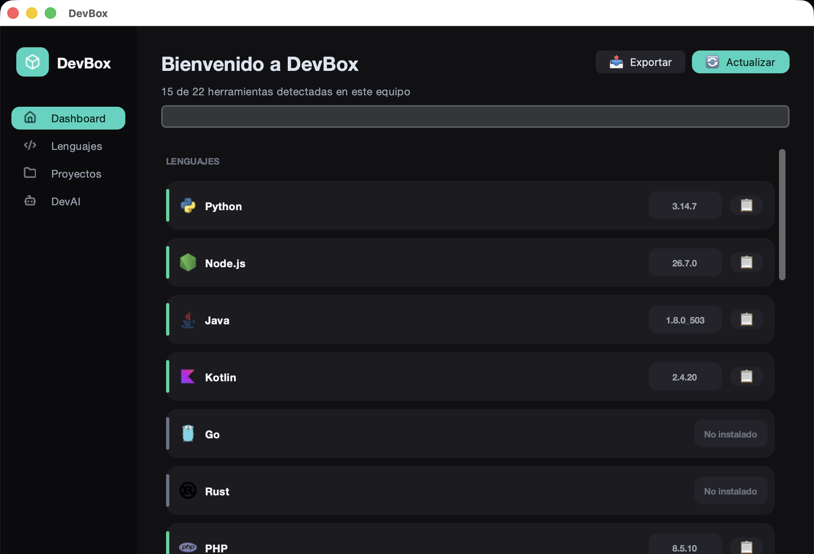
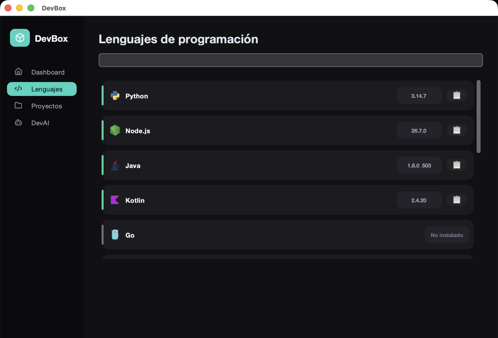
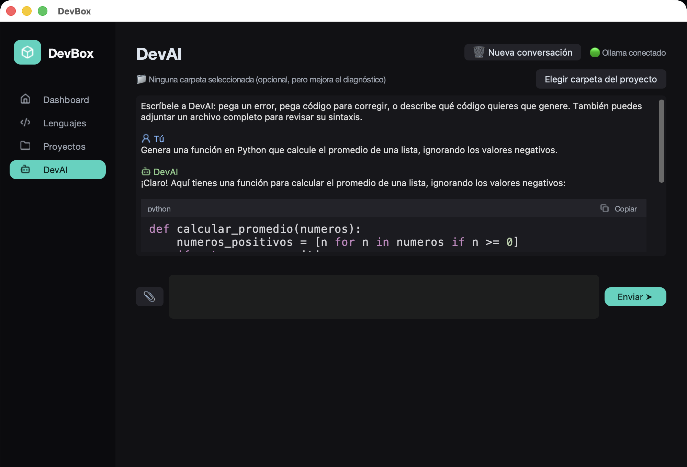

# DevBox

Centro de herramientas de desarrollo para escritorio (macOS), construido en
Python con `customtkinter`. No es un editor de código ni un clon de VS Code:
es un panel de apoyo para detectar tu entorno, explorar proyectos y contar
con un asistente de IA local que corre 100% en tu máquina.



## Características

### 📊 Dashboard
Detecta 22 lenguajes y herramientas instaladas en tu sistema (Python, Node,
Java, Kotlin, Go, Rust, PHP, Ruby, .NET, Swift, C/C++, Dart, Perl, Git,
Docker, npm, pip, Homebrew, VS Code, Maven, Yarn, CMake), con su versión
exacta y ruta. Incluye buscador en vivo, botón de actualización sin reiniciar
la app, exportación a `.json`, y copiar ruta por herramienta.



### 📁 Explorador de Proyectos
Apunta a una carpeta y detecta automáticamente el tipo de proyecto (Node,
Python, Rust, Go, Java/Kotlin, Ruby, PHP, Swift) según sus archivos clave,
cuenta archivos, revisa si tiene README/`.gitignore`/Git, y extrae las
dependencias reales declaradas.

### 🤖 DevAI — asistente de IA local
Corre sobre [Ollama](https://ollama.com) en tu máquina (modelo
`qwen2.5-coder:7b` por defecto) — sin API key, sin costo, sin límite de uso,
funciona sin internet una vez descargado el modelo.

Requiere:
```
brew install ollama
brew services start ollama
ollama pull qwen2.5-coder:7b
```

**Interfaz de chat**, con memoria de conversación real (como hablar con
Claude o ChatGPT) en vez de botones separados por modo. Escribes libremente
en un solo cuadro, y según lo que pidas en cada mensaje, DevAI:

- **Explica un error o traceback real** que le pegues (causa probable y
  solución). Si en cambio describes un comportamiento incorrecto sin ningún
  error real, te lo dice en vez de inventar una causa falsa.
- **Corrige un fragmento de código** que le pases, cuando tenga un problema
  -código completo ya corregido en un bloque de código, listo para copiar.
- **Genera código nuevo** desde una descripción -un archivo completo y
  funcional, en el lenguaje que pidas o el más razonable si no lo
  especificas. Sigue reglas fijas de calidad aprendidas con muchas pruebas
  reales: consultas SQL siempre parametrizadas, "API" significa manejo real
  de peticiones HTTP (no solo funciones sueltas), contraseñas derivadas con
  PBKDF2 de verdad (nunca una clave aleatoria), concurrencia con
  `ThreadPoolExecutor`, y varias más (ver `core/dev_ai.py`).



El chat recuerda toda la conversación -puedes pedir un ajuste sobre algo que
ya generó tres mensajes atrás ("ahora hazlo en JavaScript") y lo entiende en
contexto. Botón "🗑️ Nueva conversación" para empezar de cero.

Los bloques de código se muestran igual que en ChatGPT: con el nombre del
lenguaje, un botón de copiar, y resaltado de sintaxis (palabras clave,
strings, números y comentarios en colores distintos) -no como texto plano
con los símbolos de markdown sueltos.

**Revisar un archivo completo sigue siendo una acción explícita** (botón
"📎" para adjuntar), no algo que se intente adivinar del texto libre -es la
única parte que depende de un verificador de sintaxis determinista
(`ast.parse`, `node --check`, `php -l`, `gofmt`, `ruby -c`, `perl -c`,
`gcc`/`g++ -fsyntax-only` según el lenguaje: Python, Node.js, PHP, Go, Ruby,
Perl, C y C++), y mezclar eso con la ambigüedad de un chat libre le haría
perder la precisión que tiene hoy. Encuentra errores de sintaxis de forma
instantánea y 100% precisa, y solo entonces le pide a la IA que
explique/corrija esa línea exacta. Si la sintaxis está limpia, hace además
un vistazo rápido por posibles errores de lógica y, si algo se ve raro, te
lo dice en el chat. Para otros lenguajes sin verificador disponible, usa un
modo genérico menos preciso.

Cuando la respuesta trae un bloque de código, aparece "💾 Guardar código
como archivo". Cuando revisas un archivo adjunto y se encuentra una
corrección puntual, aparece además "✅ Aplicar corrección al archivo" (con
vista previa Antes/Después y respaldo `.bak` antes de escribir). Nota: esto
último solo aplica al resultado de adjuntar un archivo -una corrección
sugerida en el chat libre se copia a mano, no se escribe sola a ningún
archivo, para no arriesgar sobrescribir algo sin un rango de líneas exacto
de dónde vino.

  Cuenta con vista previa obligatoria ("Antes"/"Después") y respaldo
  automático (`.bak`) antes de aplicar cualquier corrección directo al
  archivo.

#### Limitaciones conocidas de DevAI

DevAI corre en un modelo local de 7B de parámetros — rápido y gratis, pero
con límites reales de razonamiento:

- **Muy confiable con un problema a la vez.** Tanto para errores de sintaxis
  (localizados por el verificador del lenguaje) como para un bug puntual en
  un fragmento de código acotado, la tasa de acierto es prácticamente
  perfecta en las pruebas realizadas.
- **Detección de varios bugs distintos en una sola revisión — mejoró
  bastante.** En pruebas originales (fragmentos con múltiples funciones y
  múltiples bugs sin ninguna pista de localización), la tasa de detección
  variaba entre 25% y 100% de los bugs presentes según la corrida. Al
  re-probarlo (2026-09-20) con tres fragmentos nuevos de bugs puramente
  lógicos (sin errores de sintaxis que sirvieran de pista fácil, incluyendo
  uno bastante sutil: una variable de un `for` que se reusa después del
  loop), el resultado fue 11 de 11 bugs detectados y corregidos
  correctamente, en corridas repetidas. El modelo (`qwen2.5-coder:7b`) no
  cambió en ese tiempo -la mejora parece venir de las reglas acumuladas en
  el prompt del sistema desde las pruebas originales. Aun así, no se
  garantiza al 100%: para una revisión confiable, sigue siendo mejor
  pedirle que corrija una función o un bug a la vez cuando el código es
  largo, en vez de pegar un archivo completo con varios problemas
  mezclados.
- Se probó también con un modelo más grande (`qwen2.5-coder:14b`) buscando
  mejorar esto, sin éxito -con cuantización de 4 bits, no superó al de 7B en
  estas mismas pruebas, y es notablemente más lento. Por eso se mantiene el
  7B como modelo por defecto.
- **Generar código nuevo es muy bueno en archivos autocontenidos, incluso
  complejos** (una API REST completa con Express, N-reinas por backtracking,
  el problema del viajante con programación dinámica, un servidor de chat
  con sockets TCP, cifrado AES con contraseña real vía PBKDF2) -verificado
  ejecutando el código de verdad en cada caso, no solo leyéndolo. Pero se le
  probaron 14 niveles de dificultad y aparecieron límites reales, cada uno
  de una naturaleza distinta:
  - **No repartía una tarea en varios archivos** (por ejemplo, una
    autenticación con config/modelo/rutas separados) -intentaba simularlo
    con comentarios dentro de un solo archivo, con un `return` a nivel
    superior que cortaba la ejecución o `require`/`import` a archivos que no
    existían. **Se corrigió** agregando una regla al prompt: ahora reconoce
    explícitamente que la tarea necesita varios archivos, dice cuáles son, y
    da a cada uno contenido real y compatible entre sí -verificado
    levantando un servidor Flask real con los dos archivos generados
    (registro, login y ruta protegida con JWT funcionando).
  - **Podía fallar en la lógica fina de algoritmos con roles que se
    alternan** (por ejemplo minimax en un juego de dos jugadores) -la
    función de la IA para "O" terminó evaluando la jugada como si fuera "X",
    y perdía contra un rival que jugara perfecto, pese a que el código corre
    sin errores. Se intentó corregir con una regla explícita y en su momento
    **no funcionó** -se confirmó con una simulación real que el bug
    persistía igual, byte por byte. **Actualización (2026-09-20):** al
    re-probar el mismo escenario (tic-tac-toe con minimax) dos veces más,
    ambas generaciones tenían la perspectiva correcta y empataron contra un
    minimax de referencia perfecto (el resultado correcto entre dos
    jugadores óptimos), incluyendo el caso de que la IA empezara jugando
    primero. El bug puntual que se documentó ya no se reprodujo. Sigue
    aplicando la recomendación general: si generas este tipo de algoritmo,
    verifícalo jugando/ejecutando varios casos reales, no solo revisando que
    corra -este tipo de bug es invisible a simple vista por diseño.
  - **Puede inventar una función o clase que no existe** en la librería que
    usa (por ejemplo `threading.Value`, que en realidad es de
    `multiprocessing`, no de `threading`). **Se corrigió** en dos vueltas:
    primero diciéndole que use `concurrent.futures.ThreadPoolExecutor` (la
    forma estándar de limitar hilos concurrentes en Python) en vez de contar
    hilos a mano, y luego siendo explícito con la línea exacta
    (`lock = threading.Lock()`) para el contador compartido. Verificado
    ejecutándolo de verdad: procesa las 10 tareas respetando el límite, y el
    contador llega exactamente a 10.
  - **Puede ignorar en silencio un requisito explícito de la descripción**
    (se le pidió cifrado "con una contraseña" y generó una clave aleatoria
    que no usaba ninguna contraseña). **Se corrigió** con una regla
    puntual -ahora deriva la clave con PBKDF2 a partir de la contraseña,
    verificado con un round-trip real que además rechaza correctamente una
    contraseña equivocada. Ojo: la primera versión de esta regla no
    especificaba la librería, y en la práctica el modelo a veces elegía
    `cryptography.fernet.Fernet` (con `Fernet.generate_key()`, otra vez sin
    contraseña) en vez de `pycryptodome` -tuvo que nombrarse explícitamente
    "usa pycryptodome, no Fernet.generate_key()" para que fuera consistente
    (confirmado 3/3 en corridas repetidas).
  - **Puede reutilizar el mismo nombre de variable para dos cosas
    distintas**, pisando un valor sin avisar (un diccionario de operadores
    sobrescrito por una lista, en un evaluador de expresiones). **Se
    corrigió** nombrando el algoritmo correcto explícitamente (descenso
    recursivo con una función por nivel de precedencia:
    `parse_factor`/`parse_termino`/`parse_suma`) en vez de solo decir qué
    no hacer -verificado con 7 casos, incluyendo asociatividad izquierda y
    paréntesis anidados, todos correctos.
  - **La protección contra path traversal no cubría rutas estilo Windows**
    (con `\` en vez de `/`). **Se corrigió** reemplazando las barras
    invertidas por barras normales antes de aplicar `basename()` -verificado
    contra 5 intentos de escape reales, incluido el de Windows que antes
    pasaba sin tocar.
  - **Un ejemplo de autenticación con Flask necesitó parches a mano**
    (faltaba crear las tablas de la base de datos, y el token JWT se creaba
    con un ID numérico cuando la librería actual exige texto). **Se
    corrigieron ambos** con reglas puntuales, confirmado con una API Flask
    real funcionando de extremo a extremo. Nota: en la regeneración de
    prueba, el modelo eligió una estructura de código distinta (un
    middleware con `before_request`) que introdujo un bug nuevo y no
    relacionado (`/protected` fallaba porque leía el usuario antes de que el
    token se verificara) -no se persiguió con una regla nueva, porque cada
    generación puede inventar una estructura distinta y no es viable cubrir
    cada variante posible. Los dos defectos puntuales que sí se apuntaron
    quedaron confirmados como arreglados.
  - **Al generar una página que muestra datos de un formulario (por ejemplo
    un inventario), puede insertarlos con `innerHTML` sin escapar** -una
    vulnerabilidad XSS real si ese dato contiene HTML/JavaScript. Se agregó
    una regla nombrando el patrón correcto (`document.createElement()` +
    `.textContent` en vez de `innerHTML` con datos interpolados), pero a
    diferencia de las reglas anteriores, esta **no se pegó de forma
    confiable** (2 de 5 generaciones seguían usando el patrón inseguro,
    incluso con la regla reforzada nombrando el caso específico de
    renderizar una lista/tabla). Al ser un hábito muy arraigado -mismo
    perfil que `toLowerCase()` en Kotlin, ver abajo- y al ser además una
    transformación estructural de código (no una sustitución de texto
    simple), no se intentó reescribir el código automáticamente por el
    riesgo de romperlo. En vez de eso, DevBox ahora **detecta el patrón
    peligroso y agrega una advertencia visible** al final de la respuesta
    cuando aparece, para que quede claro que hay que revisarlo antes de
    usarlo con datos reales.
  - **Para contraseñas de login, puede confundir "cifrar" con "hashear"**
    -guardarlas de forma reversible en vez de con un hash de un solo
    sentido. **Se corrigió** con una regla que distingue explícitamente
    este caso del cifrado con contraseña (PBKDF2, arriba): usar
    `password_hash()`/`password_verify()` en PHP o
    `werkzeug.security`/`bcrypt` en Python, nunca MD5/SHA1 ni cifrado
    reversible. Confirmado 3/3 en corridas repetidas -a diferencia del
    caso de XSS, este es un patrón "de manual" bien conocido, no un hábito
    arraigado, y se pegó perfecto desde la primera versión de la regla.
  - **En Kotlin, puede declarar `val` un campo de una `data class` que
    después necesita cambiar de valor**, y luego intentar reasignarlo
    directo -eso no compila ("Val cannot be reassigned"). Encontrado en un
    escenario real de una lista de tareas con estado "completada". **Se
    corrigió** dando dos patrones válidos (declarar ese campo `var`, o usar
    `.copy(campo = nuevoValor)` para mantener la clase inmutable).
    Confirmado 2/2 en corridas repetidas -interesante que cada corrida
    eligió una de las dos opciones válidas según el estilo que ya traía
    (SQLite crudo con `var`, Room con `.copy()`), no solo repitió la misma
    solución de memoria.
  - **En una conversación de varios turnos, si se le pide algo que su
    propia respuesta anterior ya resolvía, puede fingir una corrección
    falsa** -se disculpa por un "error anterior" que no existía y devuelve
    el mismo código sin cambios, como si lo hubiera arreglado. Se agregó
    una regla pidiendo honestidad explícita en ese caso, pero **solo
    mejoró parcialmente** (1 de 2 corridas): la otra vez repitió el mismo
    patrón, y encima le cambió de nombre a una variable sin que se lo
    pidieran. Aparte de esto, construir sobre código generado en un turno
    anterior (agregarle una función nueva, por ejemplo) funciona de forma
    consistente y confiable -el problema es específicamente el caso de
    "admite que no había nada que arreglar", no la construcción incremental
    en sí.

  **Patrón general, confirmado varias veces:** una regla que le da al
  modelo un patrón o algoritmo correcto **concreto y nombrado** a seguir
  (usar PBKDF2, usar `ThreadPoolExecutor`, usar descenso recursivo con
  funciones por nivel de precedencia, `password_hash()`/`password_verify()`
  para contraseñas de login, `var`/`.copy()` para un campo mutable de una
  `data class` en Kotlin) funciona de forma confiable -normalmente 3/3 en
  corridas repetidas. Una regla que solo dice qué NO hacer, sin nombrar la
  alternativa correcta, tiende a evitar justo ese síntoma puntual pero deja
  la tarea de fondo igual de rota por otro camino -a veces uno más
  peligroso, porque falla en silencio en vez de con un error visible.

  Dos tipos de caso se resisten más a una regla de prompt, sin importar
  qué tan concreta sea: **hábitos de código muy arraigados** (el modelo usa
  `innerHTML` con datos sin escapar, o `toLowerCase()` en vez de
  `lowercase()` en Kotlin, incluso después de una regla explícita -en esos
  casos se optó por una corrección o advertencia determinista en el código
  de DevBox en vez de seguir insistiendo por prompt), y **pedirle que
  reflexione honestamente sobre su propia respuesta anterior** en una
  conversación (por ejemplo, admitir que algo ya estaba resuelto en vez de
  fingir una corrección de un bug que no existía -mejoró de 0/2 a 1/2, no
  a un arreglo confiable). El caso del minimax (arriba) en su momento
  parecía pertenecer a esta segunda categoría, pero al re-probarse ya no se
  reprodujo.

  **Nota sobre cómo verificar un arreglo:** una sola corrida exitosa no
  confirma que algo quedó arreglado -el caso de la contraseña pasó una
  vez y luego regresó al bug original en la siguiente corrida, porque el
  modelo a veces elegía una librería distinta (`Fernet` en vez de
  `pycryptodome`) que la regla no cubría todavía. Repetir la misma
  descripción 2-3 veces antes de dar algo por resuelto reveló esto -una
  corrida no es suficiente.

  **Actualización (2026-10-02): se re-probó `qwen2.5-coder:14b` de nuevo,
  esta vez con 6 comparaciones reales (no solo las pruebas originales de
  detección de bugs) -mismo resultado.** En generación con reglas ya
  puestas y en diagnóstico de bugs sin pista, empató en calidad con el 7B
  pero fue consistentemente 1.5x-3.5x más lento. En dos apps completas de
  Android reales (Jetpack Compose + ViewModel + navegación), ninguno de
  los dos modelos resolvió todo correctamente -cada uno falló en cosas
  distintas, y el 14B incluso introdujo un bug de lógica de negocio nuevo
  que el 7B no tenía. Además, alternar entre los dos modelos saturó la
  RAM de una máquina de 16GB lo suficiente para ralentizar todo lo demás
  (load average de ~3 a 15+). Se descartó otra vez (`ollama rm`); el 7B
  sigue siendo el único modelo que usa DevBox.

  **Cuatro bugs reales de Kotlin/Android encontrados y corregidos esta
  semana, todos a partir de una tarea universitaria real (Jetpack
  Compose + ViewModel + StateFlow):**
  - Usar `ViewModelProvider(this).get(...)` dentro de una función
    `@Composable` -`this` no existe ahí, solo es válido dentro de una
    Activity/Fragment clásica. Corregido nombrando el patrón correcto
    (`viewModel()` de `androidx.lifecycle.viewmodel.compose.viewModel`).
  - Usar `MutableStateFlow.update { }` sin importar
    `kotlinx.coroutines.flow.update` -es una función de extensión, no un
    método de la clase.
  - Comparar un `Double` contra un rango escrito con enteros
    (`distancia in 2..10`) en vez de `Double` (`2.0..10.0`) -no compila
    ("type inference failed").
  - Usar `Toast.makeText(...)` sin importar `android.widget.Toast`,
    incluso cuando `LocalContext.current` sí estaba bien importado.

  Las cuatro reglas se verificaron con regeneraciones frescas (3/3 cada
  una). **Un hallazgo aparte, más interesante que cualquier bug
  individual:** la regla de `viewModel()` pasó 3/3 contra mis propias
  variantes de prueba, pero **falló al probarla contra el enunciado real
  textual** de la tarea -el modelo eligió una arquitectura distinta (dos
  Activities separadas en vez de un solo `NavHost`) que la regla no
  cubría, y volvió al patrón roto. Lección: verificar una regla con
  variantes propias no es lo mismo que verificarla con el pedido real
  que destapó el bug -el modelo puede tomar un camino arquitectónico
  distinto que la regla no anticipó.

  **También confirmado, de forma más limpia que antes:** pedirle que
  **corrija código que ya generó**, dándole el error exacto o incluso el
  código exacto de reemplazo, en la misma conversación, falló
  consistentemente (0 de 3 intentos distintos devolvieron algo distinto
  al archivo roto original -confirmado con `diff`, no a ojo). En cambio,
  pedir lo mismo en una **conversación nueva**, con la regla ya puesta en
  el prompt de sistema, funcionó bien. Recomendación práctica: si un
  resultado sale mal, no insistas en el mismo hilo -empieza una
  conversación nueva en vez de pedir que se autocorrija.

  **Un patrón arquitectónico más amplio que ningún modelo resolvió solo:**
  en dos apps de Android completas con navegación a una segunda pantalla
  (una con Activities separadas, otra con Navigation Compose), el
  `ViewModel` de la pantalla 2 nunca compartió estado con el de la
  pantalla 1 -cada pantalla obtuvo su propia instancia por separado. Con
  Navigation Compose esto es un comportamiento documentado de Android
  (cada destino del grafo de navegación tiene su propio `ViewModelStore`
  por defecto), no un bug del modelo en sí -pero ninguna de las
  generaciones probadas lo manejó bien sin que se le dijera
  explícitamente cómo. Pendiente de convertir en regla si se repite.

## Requisitos

- macOS
- Python 3.12+ (entorno virtual propio del proyecto en `.venv/`)
- [Ollama](https://ollama.com) con el modelo `qwen2.5-coder:7b` para usar DevAI

## Uso

```
cd DevBox
.venv/bin/python3 main.py
```

## Estructura

```
DevBox/
├── main.py
├── gui.py
└── core/
    ├── system.py           # detección de lenguajes/herramientas
    ├── project_analyzer.py # explorador de proyectos
    └── dev_ai.py            # integración con Ollama
```
